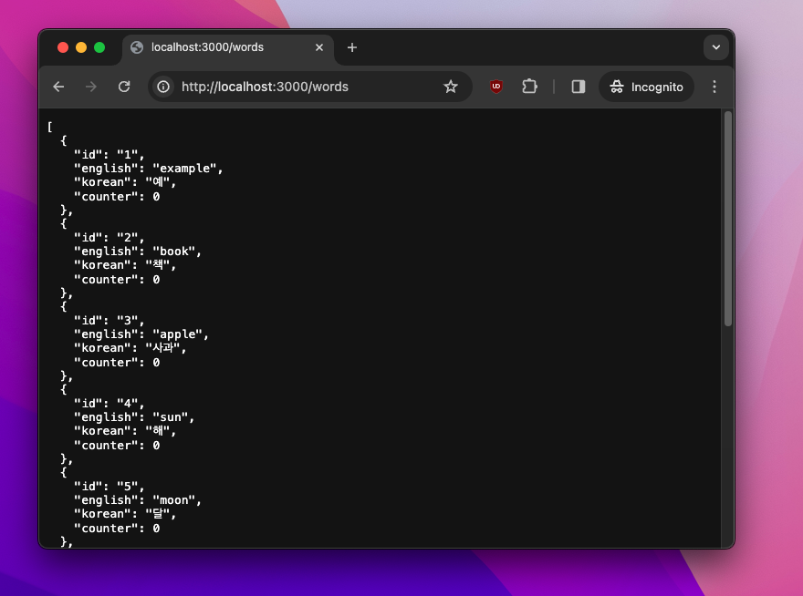

# Words API with json-server

A simple backend setup using `json-server` to manage English-Korean word pairs with a counter.

## Getting Started

### Prerequisites

- Node.js
- Yarn

### Installation

1. Clone the repository and navigate to the project directory.
2. Install dependencies:

- yarn install

### Starting the Server

Run the following command to start the server:

- yarn start

The server will be running at `http://localhost:3000`.


## API Endpoints

### Read Words

- **Get all words**: `GET /words`
- **Get a single word by ID**: `GET /words/:id`



### Add Words

To add a new word, send a POST request to `/words` with a JSON body containing the English word, Korean word, and a counter set to 0. Example:

POST /words
Content-Type: application/json

```json
{
  "english": "hello",
  "korean": "안녕",
  "counter": 0
}
```

### Update Words

To update a word, send a PATCH request to `/words/:id` with the fields you want to update. Example to increment the counter:

PATCH /words/1
Content-Type: application/json
```json
{
  "counter": 1
}
```


### Delete Words

To delete a word, send a DELETE request to `/words/:id`.

```json
DELETE /words/1
```


## Notes

- The `id` for new words is automatically generated. Do not include it in your POST request.
- Use tools like Postman or curl for interacting with the API.
- press CTRL-C in terminal to stop the server
